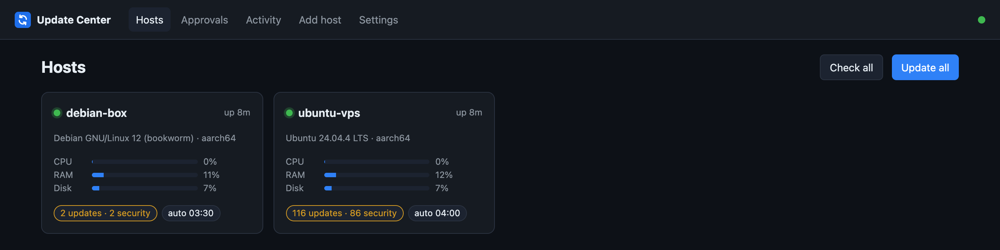
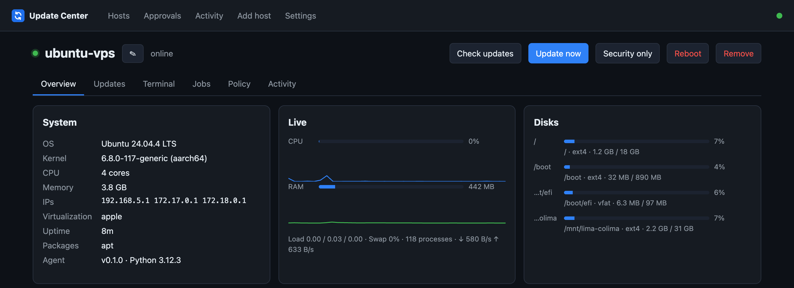
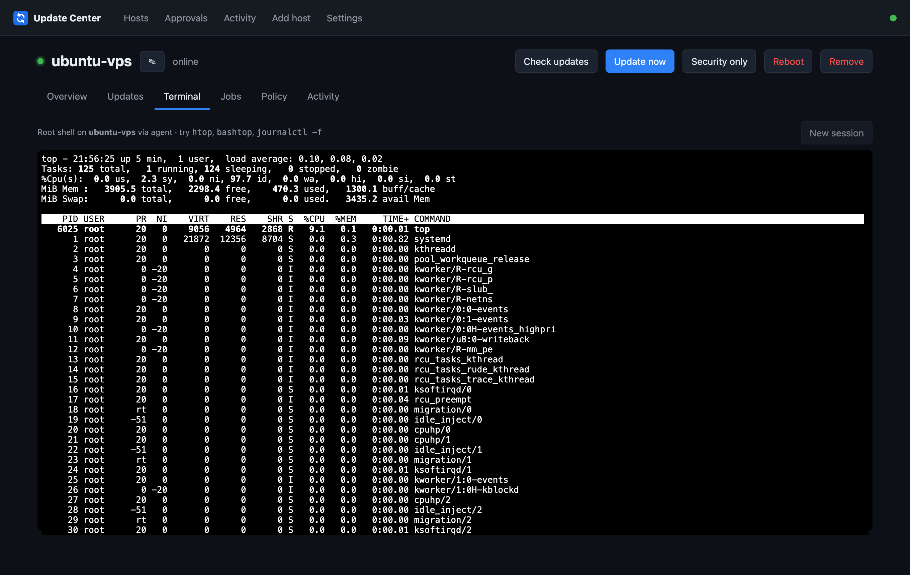
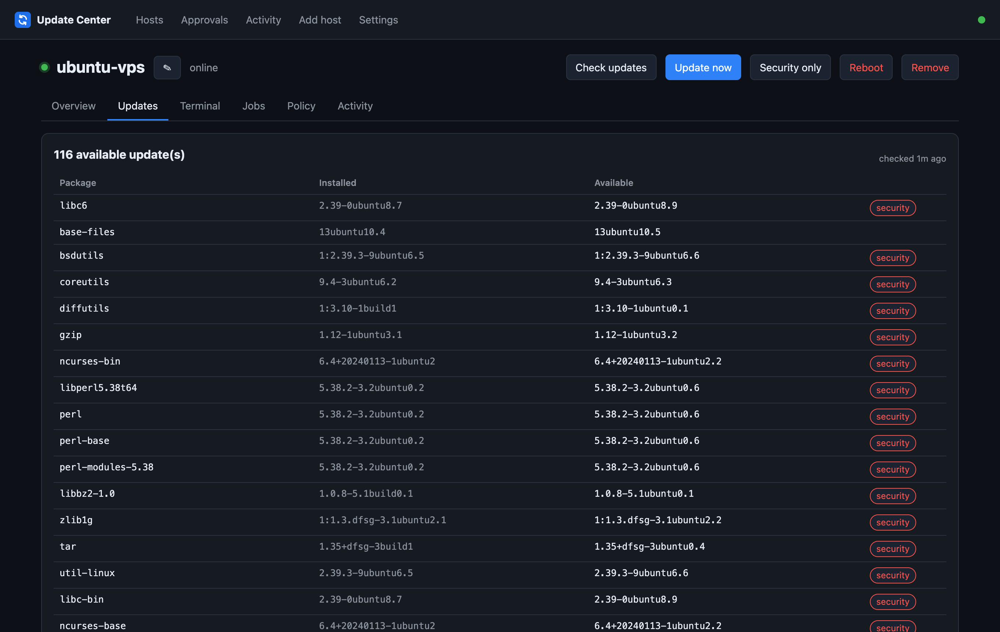
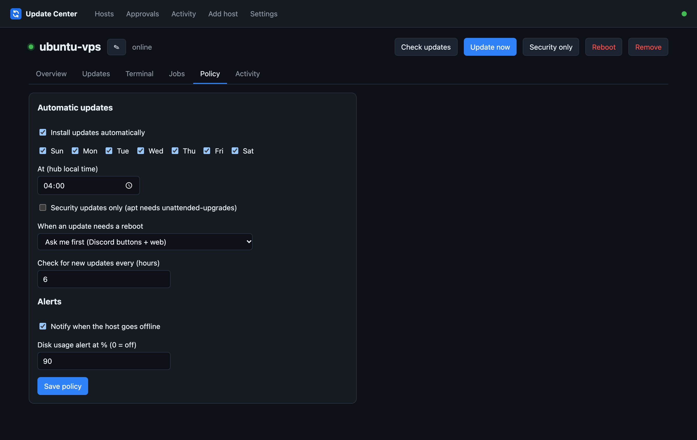

<div align="center">


# Update Center

**Self-hosted control panel for all your Linux servers.**
Web terminal · updates · reboots · auto-update policies · alerts · Discord bot that asks before rebooting.

[](https://github.com/thekingziga/update-center/actions/workflows/ci.yml)
[](https://hub.docker.com/r/thekingziga/update-center-hub)

[](LICENSE)



</div>

---

You have a few VPSes, a Raspberry Pi and a home server. Update Center lets you manage all of them from one
web page — and from Discord:

- 🖥️ **Dashboard** — every server at a glance: online status, CPU / RAM / disk, temperature, pending updates, reboot needed.
- 💻 **Web terminal** — a real root shell in your browser. `htop`, `bashtop`, `vim`, `journalctl -f` — everything works.
- 📦 **Updates** — see every pending package (security updates flagged); *Update now*, *Security only*, *Update all hosts*.
- 🔁 **Reboots** — with confirmation, notification when the server is back, alarm if it isn't.
- ⏰ **Policies per host** — auto-update on chosen days and time, security-only, and what to do when a reboot is needed:
  **reboot automatically**, **ask me first**, or **never**.
- ✅ **Approvals** — "ask me first" sends you a Discord message with **Approve / Deny** buttons (and a banner in the web UI).
- 🔔 **Alerts** — host offline / back online, disk almost full, new updates, failed upgrades, failed systemd units.
- 🤖 **Discord bot** — `/hosts`, `/status`, `/check`, `/update`, `/reboot`, `/approvals`.
- 🧰 **Extras** — run commands with live output and history, top processes, Docker containers, full activity log.
- 🐧 **Any distro** — apt (Debian, Ubuntu, Raspberry Pi OS), dnf/yum, pacman, zypper, apk.
- 🔒 **No open ports on your servers** — agents connect *out* to the hub; works behind NAT/home routers.

## How it works

```
                       ┌──────────────────────────────┐
  Browser ──HTTPS────► │  HUB  (Docker / Node.js)     │ ◄──── Discord bot / webhook
                       │  web UI · API · scheduler    │
                       │  SQLite                      │
                       └──────────────▲───────────────┘
                                      │ outbound WebSocket (wss://)
          ┌───────────────────────────┼───────────────────────────┐
     ┌────┴─────┐               ┌─────┴────┐                ┌─────┴────┐
     │ agent    │               │ agent    │                │ agent    │
     │ VPS #1   │               │ VPS #2   │                │ RPi 4    │
     └──────────┘               └──────────┘                └──────────┘
```
- **Hub** — one instance; website, API, schedules, Discord. Docker image `thekingziga/update-center-hub`.
- **Agent** — tiny Python script (standard library only) running as root on each server, installed by a one-line
  script or as the Docker image `thekingziga/update-center-agent`.

## Quick start

**1. Start the hub** (any always-on machine with Docker):
```bash
git clone https://github.com/thekingziga/update-center.git && cd update-center
cp .env.example .env          # set PUBLIC_URL and TZ
docker compose up -d          # or: docker compose --profile https up -d  (automatic HTTPS)
```
Open `http://<hub-ip>:8080` and create your admin account.

**2. Add servers:** *Add host* → **Generate install command** → run it on the server:
```bash
curl -fsSL https://hub.example.com/install.sh | sudo sh -s -- --hub https://hub.example.com --token <one-time-token>
```
…or as a container:
```bash
docker run -d --name uc-agent --restart unless-stopped --privileged --pid host \
  -e UC_HUB=https://hub.example.com -e UC_TOKEN=<one-time-token> thekingziga/update-center-agent
```

**3. Optional:** connect Discord, set auto-update policies — done.

## Documentation

| Guide | |
|---|---|
| 📘 [Installing the hub](docs/hub.md) | Docker Compose, automatic HTTPS with Caddy, `docker run`, Node.js + systemd, backup, updating |
| 🐧 [Installing the agent](docs/agent.md) | Install script or Docker, supported distros, updating, uninstalling, troubleshooting |
| 🤖 [Discord setup](docs/discord.md) | Webhook in 1 minute, or the full bot with commands and approval buttons |
| 🧭 [Using Update Center](docs/usage.md) | Dashboard, terminal, jobs, policies, approvals |
| 🔒 [Security](docs/security.md) | How it's protected and a hardening checklist |
| 🛠️ [Development](docs/development.md) | Project layout, local testing, building multi-arch images, releases |

## Screenshots

| Host overview | Web terminal |
|---|---|
|  |  |
| **Pending updates** | **Auto-update & reboot policy** |
|  |  |

## ⚠️ Security note

The agent runs as root and the web terminal is a root shell — **whoever controls the hub controls all your servers.**
Put the hub behind HTTPS (`--profile https`) or a VPN like Tailscale, use a strong password and limit Discord
commands to your own user ID. Details: [docs/security.md](docs/security.md).

## Roadmap
- [ ] TOTP two-factor login, multiple users with roles
- [ ] Reboot maintenance windows (upgrade any time, reboot only 03:00–05:00)
- [ ] Agent self-update from the hub, host groups/tags
- [ ] Service manager UI (systemd units), journal viewer, Docker controls
- [ ] Long-term metrics history, Prometheus export
- [ ] Telegram / ntfy / e-mail notifications

## License
[MIT](LICENSE)
